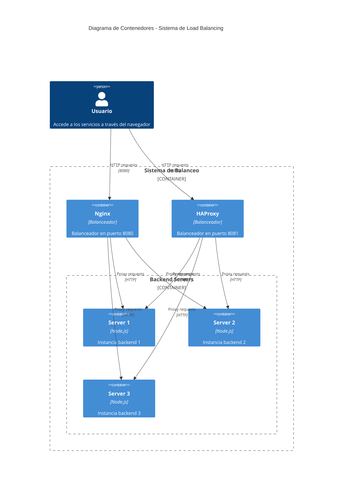

# Sistema de Load Balancing con Docker Compose

## Descripción General
Esta solución implementa un **sistema de balanceo de carga** utilizando dos tecnologías diferentes (Nginx y HAProxy) para distribuir peticiones HTTP entre tres servidores backend idénticos.

## Componentes Principales

### 🚦 Balanceadores de Carga
| Componente | Puerto | Configuración | Función |
|------------|--------|---------------|---------|
| **Nginx**  | 8080   | `nginx.conf`  | Balancea tráfico usando algoritmo Round-Robin con peso|
| **HAProxy**| 8081   | `haproxy.cfg` | Balancea tráfico usando algoritmo Round-Robin |

### ⚙️ Backend Servers
- Tres instancias idénticas (`server1`, `server2`, `server3`)
- Imagen base: `arqsw2-server` (construida desde `./server/Dockerfile`)
- Red: `internal` (aislada)

### 🌐 Redes Docker
   
   - `loadBalancer`: Red puente para exponer Nginx y HAProxy.
   
   - `internal`: Red privada donde los balanceadores comunican con los servidores backend.




# Build de las imagenes
Este paso es necesario tanto en kubernetes como en docker compose

``` bash
docker compose build
``` 

# Docker
``` bash
docker compose up -d
``` 


